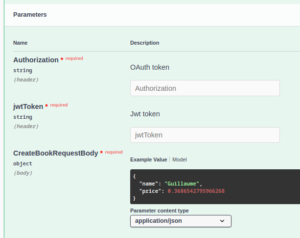
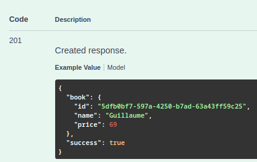
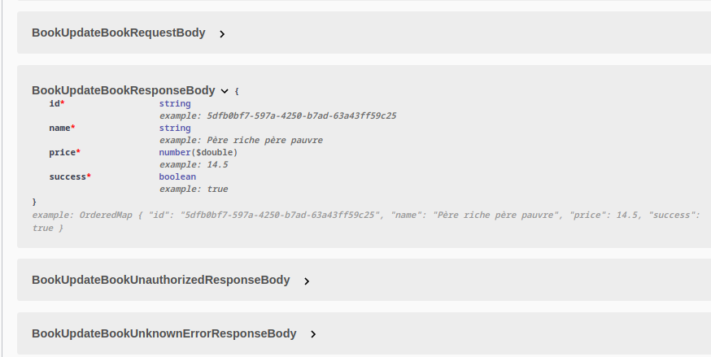

# GOA API

### What is that ?
A starter-pack to start all its APIs in golang.
We'll use Goa, it's a framework for building micro-services and APIs in Go using a unique design-first approach.

### Why I use GOA DESIGN ?

### Reason n°1: Postman updated every time the design file is modified
Just do:
```sh
make api-goa
```
File: openapi.json
---------------------
**You will have a new postman with all the expected requests, payloads and authentication system**

### Reason n°2: Automatically updated online documentation without writing a single line of HTML, CSS and Javascript
Documentation is based on generated postman file
Just do:
```sh
make api-doc
```
### In this documentation you will have:
- All possible requests


--------------------------

- All expected payloads for each request with examples



--------------------------

- All responses to each request


--------------------------

- All expected structures with their types (int, float, string, boolean)



