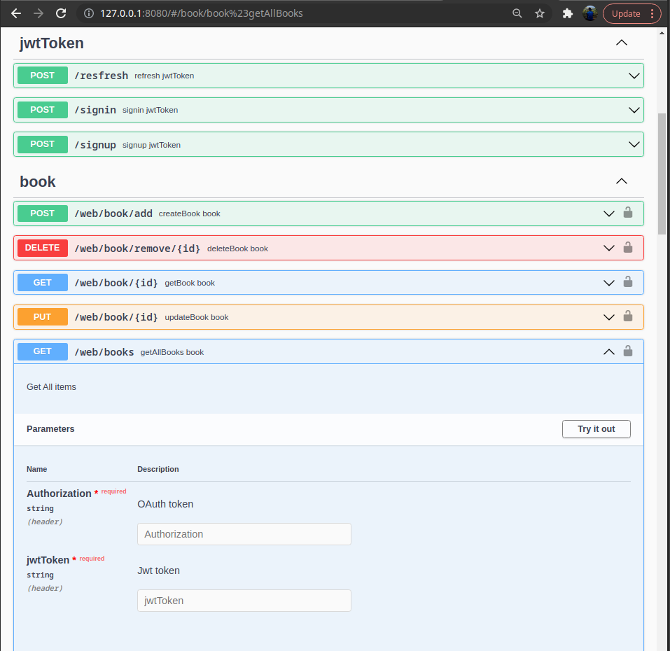
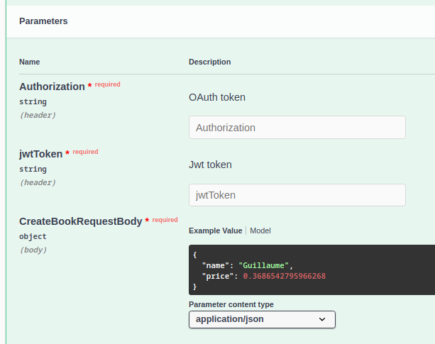
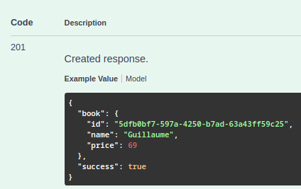
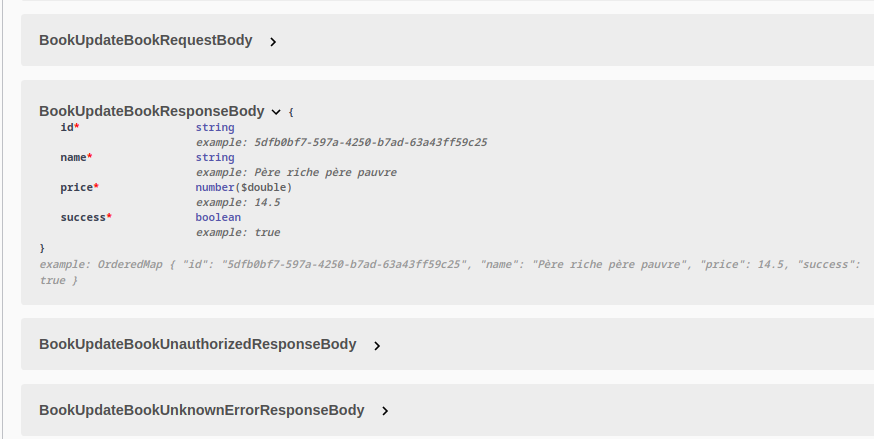
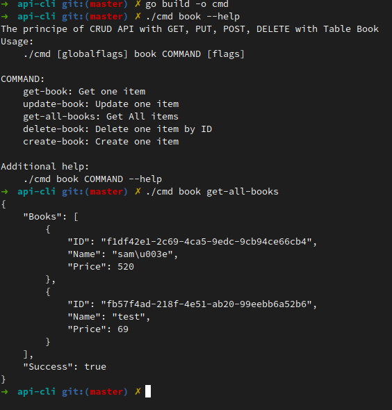
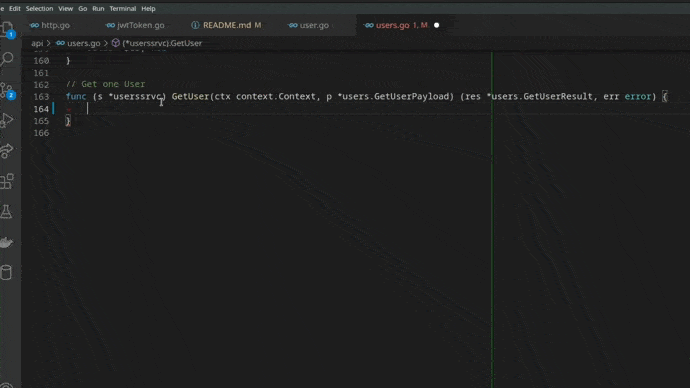

# 🔥 GOA GM

### What is that ?
<a href="https://golang.org" target="_blank">  </a>
A starter-pack to make its APIs in golang.
We'll use Goa, it's a framework for building micro-services and APIs in Go using a unique design-first approach.

We also use ***sqlc*** that generates type-safe code from SQL.

### Why I use GOA DESIGN ?

**Reason n°1: Postman updated every time the design file is modified**

Just do:
```sh
make api-goa
```
File: openapi.json

You will have a new postman with all the expected requests, payloads and authentication system

**Reason n°2: Documentation automatically updated without writing a single line of HTML, CSS, and JavaScript**

Documentation is based on generated postman file

Just do:
```sh
make api-doc
```
In this documentation you will have:
- All possible requests



--------------------------

- All expected payloads for each request with examples




--------------------------

- All responses to each request



--------------------------

- All expected structures with their types (int, float, string, boolean)



**Reason n°3: 70% of your code is generated**

As the Goa design language is Go DSL, it is easy to customize and understandable by anyone.
It is from this GOA DSL that all the code will be generated.

```go
	Method("createBook", func() {
		Description("Create one item")
		Security(OAuth2, JWTAuth)
		Payload(func() {
			Attribute("name", String, func() {
				MinLength(3)
				MaxLength(10)
				Description("Name of the book")
				Example("Guillaume")
			})
			Attribute("price", Float64, func() {
				Description("Price of the book")
				Minimum(0.1)
			})
			TokenField(1, "jwtToken", String, func() {
				Description("JWT used for authentication after Signin/Signup")
			})
			AccessTokenField(2, "oauth", String, func() {
				Description("Use to generate Oauth with /authorization")
			})
			Required("name", "price", "oauth", "jwtToken")
		})
		HTTP(func() {
			POST("/book/add")
			Header("oauth:Authorization", String, "OAuth token", func() {
				Pattern("^Bearer [^ ]+$")
			})
			Header("jwtToken:jwtToken", String, "Jwt token", func() {
				Pattern("^Bearer [^ ]+$")
			})
			Response(StatusCreated)
		})
		Result(func() {
			Attribute("book", BookResponse, "Result is an object")
			Attribute("success", Boolean)
			Required("book", "success")
		})
	})
})
```
```go
    var BookResponse = Type("BookResponse", func() {
        Attribute("id", String, func() {
            Format(FormatUUID)
            Example("5dfb0bf7-597a-4250-b7ad-63a43ff59c25")
        })
        Attribute("name", String, func() {
            Example("Guillaume")
        })
        Attribute("price", Float64, func() {
            Example(69.0)
        })
        Required("id", "name", "price")
    })
```

**For example:**

We understand very clearly that this request:

=> Create an item

=> Attend name, price, jwtToken and oauth as payload

=> The route is /book/add

=> The response will return id, name, price and a success

**Reason n°4: You can run your requests from the command line**

<a href="https://postman.com" target="_blank">  </a>
If you don't like Postman, no problem⛔
Goa automatically generates the code to be able to test all your requests on your terminal

Just do:
```sh
cd cmd/api-cli && go build -o cmd
```



--------------------------

### Why I use GOA GM ?

**Your CRUD application in 5 minutes thanks to snippets**

GOA GM offers you many snippets. You will just have to choose the name and to insert for the "Create" and "Update" method the parameters you want. No more no less.

Some examples of snippets used:

In go:

=> Get an item (goa-get)

=> Get all the items (goa-gets)

=> Delete an item (goa-delete)

=> Create an item (goa-create)

=> Update an item (goa-update)

SQL:

=> Create all sql commands for a basic crud (goa-sql)

***Example to create an item***



**To start with docker, do:**

```sh
make api-init && make api-dev
```

**Unit test in progress...**
